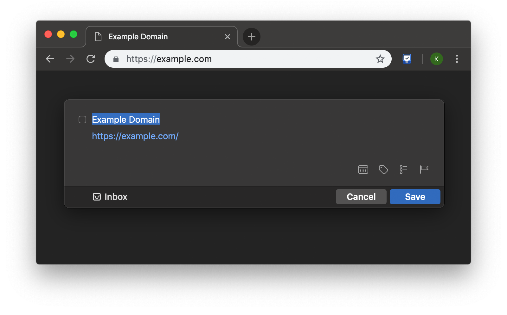
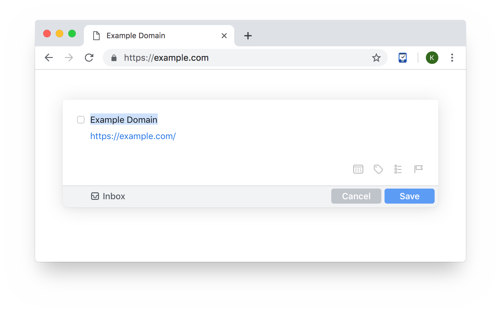

 Add to Things 3

Adds currently opened page to [Things 3](http://culturedcode.com/things/) task manager for macOS. The page title is used as the task title, and both the URL and the selected text are included as a note. 

Compatible with Dark Mode and dark themes.

Install the extension on your Chrome browser from [here](https://chromewebstore.google.com/detail/add-to-things-3/eeghakjpbmnmphbnbffghocjldpojgal)

Install the extension on your Firefox browser from [here](https://addons.mozilla.org/en-US/firefox/addon/add-to-things-3/)

## Privacy 
 
 No information is collected. The text and URL captured are processed on your device and is never transmitted anywhere outside your browser and your Things APP.

 ## Screenshots

---
Licensed under MIT License. Forked from [KristofferR](https://github.com/kristofferR/add-to-things-3). Also, thanks to [Cheapeone](https://github.com/cheapeone) for the major code refactoring.